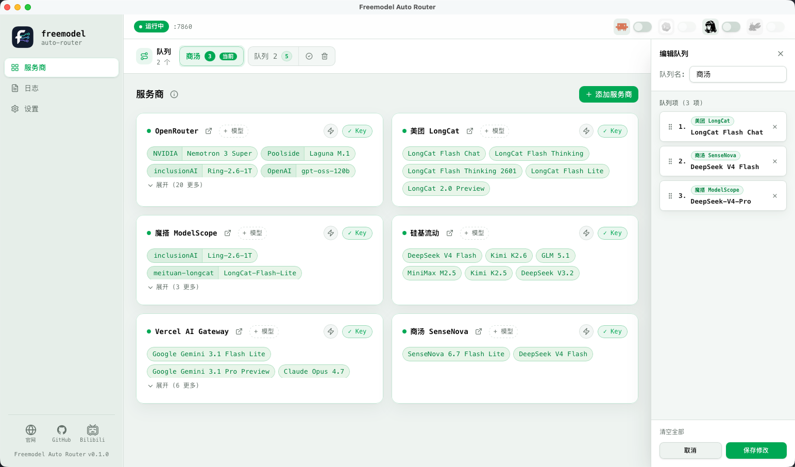
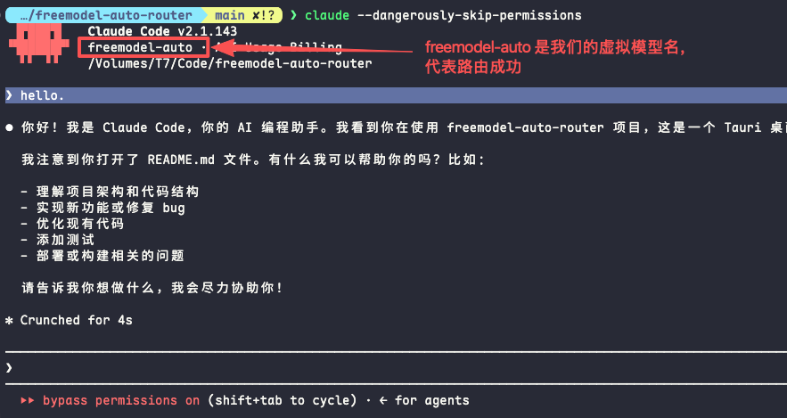
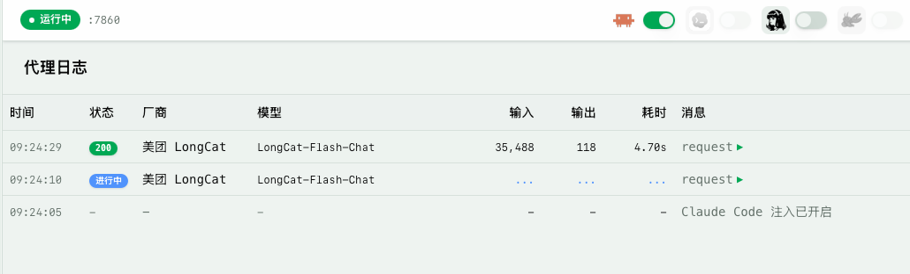

# Freemodel Auto Router

Freemodel Auto Router 是一个 Tauri 桌面应用，会在本机启动 OpenAI / Anthropic 兼容代理，把 Claude Code、Hermes、OpenClaw 等客户端的请求转发到队列中的模型供应商。当前供应商不可用、限流或返回 5xx 时，应用会按队列自动重试和切换，减少手动改 Key、改 base URL、改模型名的频率。



## 核心亮点

- **OpenCode Go 订阅转 Claude Code 协议**：通过 Anthropic ↔ OpenAI 请求/响应转换，将 OpenCode Go 等 OpenAI 协议的订阅服务代理为 Claude Code 兼容的 Anthropic 协议，让你可以直接在 Claude Code 中使用 OpenCode Go 的模型。
- 使用你指定的模型：不同服务商提供了多个免费模型，大部分情况下，我们只想使用优秀的模型，这个应用可以把不同服务商的模型聚合到一个队列里，只使用你选择的模型。
- 额度耗尽自动路由：当一个模型触发限流、额度耗尽或上游故障时，代理会按队列自动重试并切换到下一个可用模型，而不需要你手动干预。





## 主要功能

- **Anthropic ↔ OpenAI 协议转换**：支持将 Anthropic Messages API 请求转换为 OpenAI Chat Completions 格式，并将响应转换回 Anthropic 格式，实现跨协议代理（如 OpenCode Go 订阅转 Claude Code 协议）。
- 多供应商路由：内置 OpenRouter、ModelScope、LongCat、SiliconFlow、SenseNova、Vercel AI Gateway、OpenCode Go 等供应商，并支持添加自定义供应商，便于筛选和组合更值得使用的免费模型。
- 多队列管理：可以创建多个模型队列，拖拽调整优先级，设置默认队列。
- 自动重试和切换：遇到 `429`、`500`、`502`、`503`、`504` 或上游请求错误时，先按配置重试，超过次数后切到队列里的下一个可用模型。
- OpenAI / Anthropic 双协议：供应商可分别配置 `openai_url` 和 `anthropic_url`，代理会根据访问前缀选择上游端点。
- 模型名自动改写：客户端传入的 `model` 会被替换为当前队列项指定的模型 ID。
- API Key 独立管理：Key 存在本机 `auth.json`，和可同步的路由配置分离。
- 客户端配置注入：支持在应用顶部开关中为 Claude Code、Hermes、OpenClaw 写入代理配置；Codex 注入后端已实现，当前 UI 暂时标记为开发中。
- 安装检测：自动检测 Claude Code、Hermes、OpenClaw 是否已安装，未安装时禁用对应开关。
- 代理日志：展示请求状态、供应商、模型、输入/输出 token、耗时、请求头和响应头，并自动脱敏敏感字段。
- 连接测试：可对已配置 Key 的供应商发起测试请求，查看连通性和延迟。
- 供应商配置同步：启动后会从线上地址检查预设供应商配置更新；本地自定义供应商和自定义模型单独保存。
- 版本检查：设置页可检查 GitHub Release 是否有新版本。
- 系统托盘：关闭窗口时隐藏到托盘，点击托盘图标可恢复窗口。

## 使用流程

1. 启动应用。
2. 在「服务商」页为供应商填写 API Key，或添加自定义供应商和模型。
3. 新建或编辑队列，把要使用的模型加入队列并拖拽排序。
4. 将需要日常使用的队列设为默认队列。
5. 在右上角打开目标客户端开关，例如 Claude Code、Hermes 或 OpenClaw。
6. 正常使用客户端。请求会进入本机代理，并按当前队列转发到上游供应商。

队列里的当前可用项由后端维护。某个模型连续失败超过 `max_retries` 后会被标记为耗尽，代理会切换到同一队列里的下一个可用项；所有项都耗尽后返回错误。编辑队列会重置该队列的运行状态。

## macOS 文件损坏提示

如果 macOS 提示“Freemodel Auto Router 已损坏，无法打开”，通常是系统给下载的应用加了隔离属性。可以在终端执行：

```bash
sudo xattr -dr com.apple.quarantine "/Applications/Freemodel Auto Router.app"
```

如果应用不在 `/Applications`，请把命令里的路径替换成实际的 `.app` 路径。执行后重新打开应用即可。

## 支持的客户端

| 客户端      | 当前状态              | 注入方式                                                      | 代理前缀     |
| ----------- | --------------------- | ------------------------------------------------------------- | ------------ |
| Claude Code | 可用                  | 修改 `~/.claude/settings.json` 中的环境变量，并保留备份       | `/anthropic` |
| Hermes      | 可用                  | 修改 `~/.hermes/config.yaml` 的模型和 `custom_providers` 配置 | `/openai`    |
| OpenClaw    | 可用                  | 修改 `~/.openclaw/openclaw.json` 的 providers 配置            | `/openai`    |
| Codex       | 后端已实现，UI 暂禁用 | 修改 `~/.codex/auth.json` 和 `config.toml`                    | `/openai`    |

> **OpenCode Go 使用方式**：在 Claude Code 中配置代理地址 `http://127.0.0.1:7860/anthropic`，队列中添加 OpenCode Go 供应商和模型，即可通过 OpenCode Go 订阅使用 Claude Code。代理会自动完成 Anthropic ↔ OpenAI 协议转换。

Claude Code 关闭注入时会恢复备份配置。应用正常退出时也会尝试清理 Claude Code 代理配置。

## 配置文件

运行时配置目录固定为：

```text
~/.config/freemodel/
```

主要文件：

| 文件                    | 说明                                               |
| ----------------------- | -------------------------------------------------- |
| `config.json`           | 端口、重试配置、队列、默认队列、应用映射           |
| `auth.json`             | `provider_id -> API Key`，只保存在本机             |
| `providers.json`        | 预设供应商列表，可由线上配置同步更新               |
| `custom_providers.json` | 用户自定义供应商，以及给预设供应商追加的自定义模型 |

## 开发

环境要求：

- Node.js 18+
- pnpm
- Rust 工具链
- Tauri 2 支持的桌面平台，macOS / Windows / Linux

常用命令：

```bash
pnpm install
pnpm tauri dev
```

只启动前端：

```bash
pnpm dev
```

构建：

```bash
pnpm build
pnpm tauri build
```

测试和类型检查：

```bash
pnpm build
cargo test --manifest-path src-tauri/Cargo.toml
```

## 技术栈

| 层             | 技术                                               |
| -------------- | -------------------------------------------------- |
| 桌面应用       | Tauri 2                                            |
| 前端           | React 19、TypeScript、Vite 7、Tailwind CSS 4       |
| UI             | Radix UI、shadcn 风格组件、lucide-react            |
| 拖拽排序       | `@dnd-kit/core`、`@dnd-kit/sortable`               |
| 后端 HTTP      | axum 0.7、reqwest 0.12、hyper 1                    |
| 协议转换       | Anthropic Messages API ↔ OpenAI Chat Completions   |
| 异步运行时     | tokio                                              |
| 通知和打开链接 | `tauri-plugin-notification`、`tauri-plugin-opener` |

## 项目结构

```text
src/
  App.tsx                    前端状态容器和页面编排
  api.ts                     Tauri invoke API 封装
  types.ts                   前端类型定义
  components/
    ProvidersPage.tsx        服务商、模型和队列管理
    QueueTabs.tsx            队列标签栏
    QueueEditPanel.tsx       队列编辑面板
    LogsPage.tsx             代理日志
    SettingsPage.tsx         端口、重试、版本检查
    TopBar.tsx               代理状态和客户端注入开关
    OnboardingModal.tsx      首次使用说明
  lib/
    queue.ts                 队列去重等工具
    onboarding.ts            首次引导状态
    analytics.ts             前端事件记录入口

src-tauri/src/
  lib.rs                     Tauri 入口、commands、托盘、代理生命周期
  config.rs                  配置结构、读写和旧队列迁移
  providers.rs               预设供应商、自定义供应商、线上同步和迁移
  auth.rs                    API Key 读写
  router.rs                  队列运行状态、失败计数和切换逻辑
  proxy.rs                   axum 代理、协议适配、日志和 token usage 解析
  proxy_log.rs               环形代理日志和脱敏
  app_detection.rs           客户端安装检测
  claude_settings.rs         Claude Code 配置注入
  codex_settings.rs          Codex 配置注入
  hermes_settings.rs         Hermes 配置注入
  openclaw_settings.rs       OpenClaw 配置注入
```

## 注意事项

- 代理只监听 `127.0.0.1`，默认端口为 `7860`。
- 修改端口后需要重启代理服务，设置页会调用后端重启代理。
- 供应商是否支持某个协议取决于对应 URL 是否已配置；访问缺失 URL 的协议前缀会返回 `503`。
- 日志会脱敏 `authorization`、`api-key`、`token` 等敏感字段，但仍不建议在公开场合贴完整日志。
- 本项目当前是私有项目，暂未声明开源许可证。
